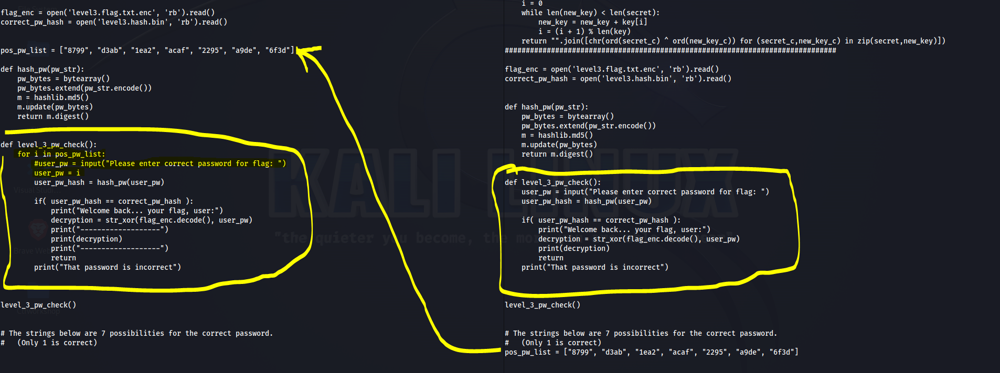

# PW Crack 3

<br>

## PROBLEM

<br>

>   Can you crack the password to get the flag?   
    Download the password checker here and you'll need the encrypted flag and the hash in the same directory too.  
    There are 7 potential passwords with 1 being correct. You can find these by examining the password checker script.   

<br>

## SOLUTION

<br>

1. Download all files.. So here we have to enter 7 different  passwords and rerun the script if it incorrect 

2. This time I became lazy and I have done this in another way. 

3. I open the code in code editor & changed the code like below. 

```
Note left side is edited code , RIght side is Original code


```



```


2 changes I have made here

    1. I have mode password list to the top above ie, it should came above level_3_pw_check() inorder to work

    2. Used a for loop to take each password from the list of pos_pw_list and pass it to user_pw variable

```

<br>

4. It will give you the flag .

<br>


## LEARNINGS

<br>

1. Understand the code and How is it working

2. Tweak it, play with it

3. Mostly importantly think outside of the box

4. I know this is a simple one but believe me If you do this like this It will help in you future CTFs & Hacking