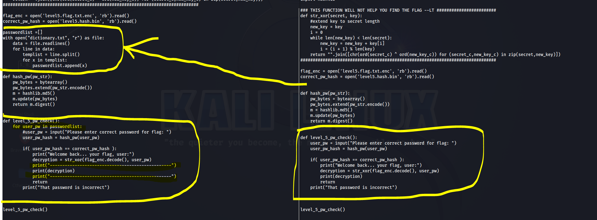

# PW Crack 5

<br>

## PROBLEM

<br>

>   Can you crack the password to get the flag?    
    Download the password checker here and you'll need the encrypted flag and the hash in the same directory too.    
    Here's a dictionary with all possible passwords based on the password conventions we've seen so far. 

<br>

## SOLUTION

<br>

1. Download all files.. So here we have to take password from an text file

2. So this about file handling and rewriting the code

3. I open the code in code editor & changed the code like below. 

```
Note left side is edited code , RIght side is Original code


```



```


2 changes I have made here

   1. Added the code for reading each password from the file "dictionary.txt" and appending to a list "passwordlist"

   2. Used a for loop to take each password from the list of "passwordlist" and pass it to "user_pw variable"

```

<br>

4. It will give you the flag .

<br>


## LEARNINGS

<br>

1. Understand the code and How is it working

2. Tweak it, play with it

3. Mostly importantly think outside of the box

4. I know this is a simple one but believe me If you do this like this It will help in you future CTFs & Hacking

5. [Python File Handling](https://www.geeksforgeeks.org/file-handling-python/)
