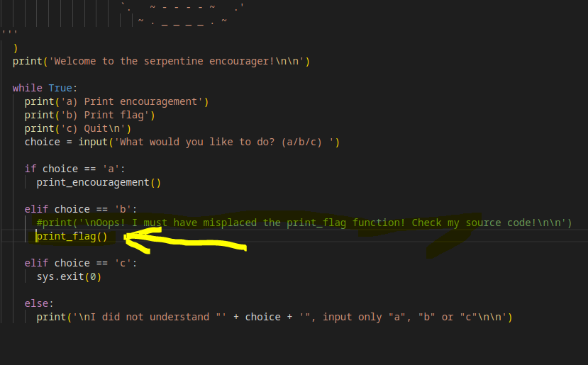

# Serpentine

 

## PROBLEM

 

>  Find the flag in the Python script!

 

## SOLUTION

 

1. Download the script.

2. Run the code - It will show that there is some error in code

3. CHange the code like below

4. Run the script & give the suitable option - it will print the flag

 

## LEARNINGS

 

