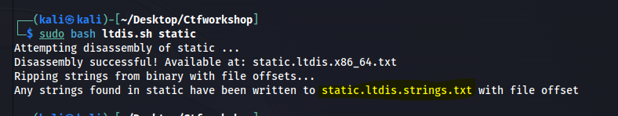

# Static ain't always noise


## PROBLEM


> Can you look at the data in this binary: static? This BASH script might help!


## SOLUTION


1. Download both files - static and Bash file


2. Make it executable by below code


```

chmod +x ltdis.sh   

```

3. Execute the script - it will ask for input file - give the bash file


```

sudo bash ltdis.sh static  

```

4. Two files will be generated in your current folder, open the file mentioned in the below screenshot


    


5. Go through the file You will find the flag.

## LEARNINGS

1. [BASH & SCRIPTING](https://www.geeksforgeeks.org/bash-scripting-introduction-to-bash-and-bash-scripting/) --> This one is more important

2. [bash cheatsheet](https://devhints.io/bash)


