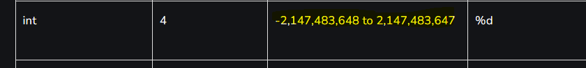
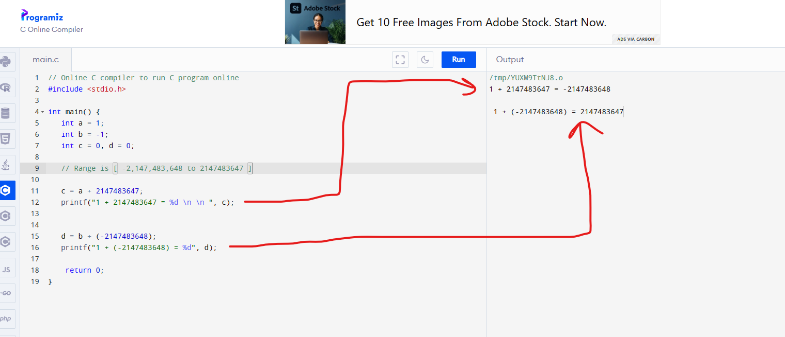
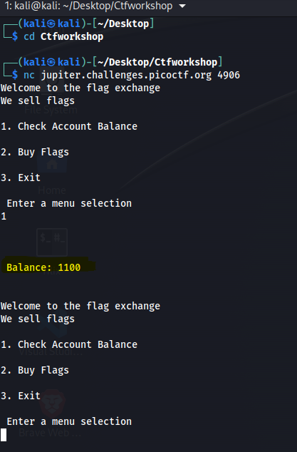
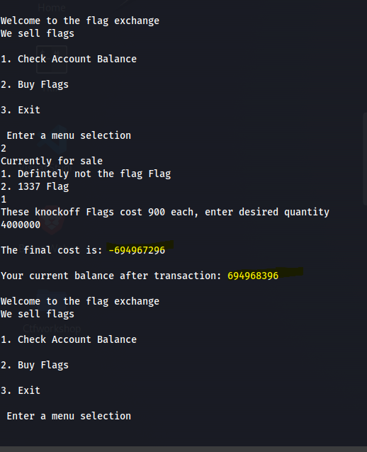

# flag_shop

<br>

## PROBLEM

<br>


> There's a flag shop selling stuff, can you buy a flag? Source. Connect with nc jupiter.challenges.picoctf.org 4906.

<br>


## SOLUTION

<br>

<p> Guys, This CTF takes more than 1 hour to understand and find flag. Yep, This post will be a long I will try to make it as simple as. <p>

<br>

First, For every [data types in C language](https://www.geeksforgeeks.org/data-types-in-c/) there is a range. Note, here we are considering the "int" data type. <br><br>

 <br><br>

Okay, Now Keep in mind this question? What happens when we gave or result of some caluclations is beyond it's range to a variable which int???<br>

Answer is [Overflow & Underflow](https://www.scaler.com/topics/c/overflow-and-underflow-in-c/) . i'll show you an simple example. <br><br>

 <br><br>


1. Now connect the system <br>

<br>

```
nc jupiter.challenges.picoctf.org 4906.

```
<br>

2. First check the balance using 1 option.  <br><br>
 <br><br>

3. Now buy some flags using 2 then 1 option respectively, I have given 4000000 <br><br>
 <br><br>

4. Now buy the 1337 flag . You can see the flag <br>
<br>


## LEARNINGS

<br>

1. [Overflow & Underflow](https://www.scaler.com/topics/c/overflow-and-underflow-in-c/)