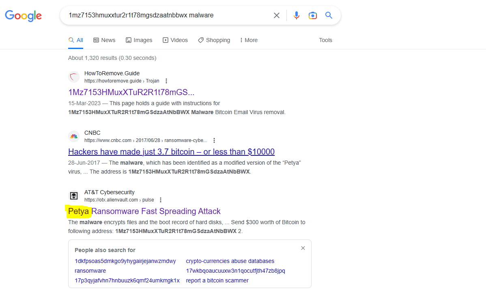
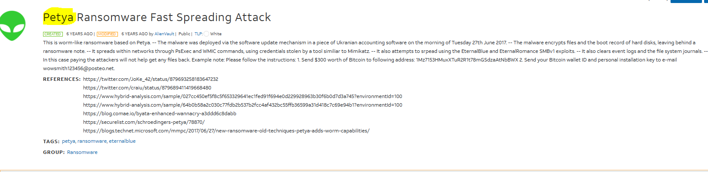

# money-ware

 

## PROBLEM

 

> Flag format: picoCTF{Malwarename}   
    The first letter of the malware name should be capitalized and the rest lowercase.   
    Your friend just got hacked and has been asked to pay some bitcoins to 1Mz7153HMuxXTuR2R1t78mGSdzaAtNbBWX. He doesn’t seem to understand what is going on and asks you   for advice. Can you identify what malware he’s being a victim of?  

 

## SOLUTION

 

This was not quite easy, went for hint.

1. I took the address and search it in Google, Came to know that it's bitcoin address 

2. THen search with the malware related to this address, got below results find the malware name

 

 

 

3. Paste the malware name in the required format.

 

## LEARNINGS

 
