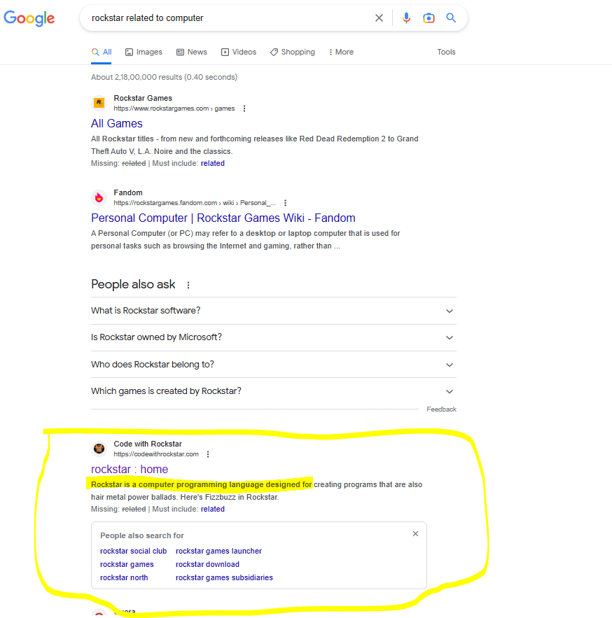
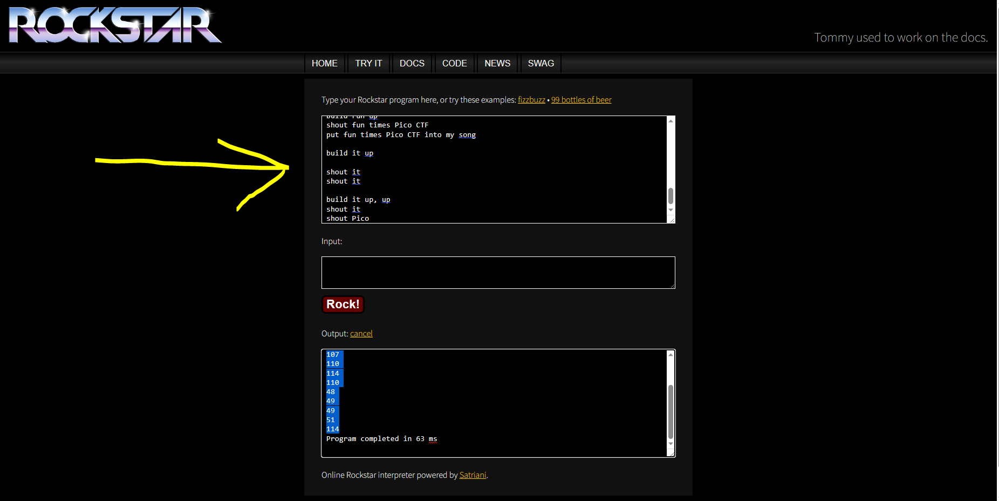

# mus1c

 

## PROBLEM

 

> I wrote you a song. Put it in the picoCTF{} flag format

  

## SOLUTION

 

1. From the Hint, This is something related to Music - It said about Rockstar

2. I searched Google & I find this

 

 

3. Came to know that it's a programming language. I quickly open its [official site](https://codewithrockstar.com/)

4. There is online decoder for it 

5. I pasted the lyrics into site and Click on "Rock"

 

 

6. It gives output in ASCII FOrmat

7. COnvert ASCII value to text format - [site](https://codebeautify.org/ascii-to-text)

8. Paste the converted text in the format "picoCTF{}"
 

## LEARNINGS

 

1. [Rockstar](https://codewithrockstar.com/)